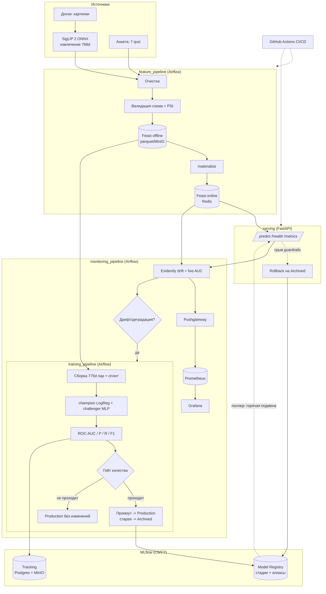
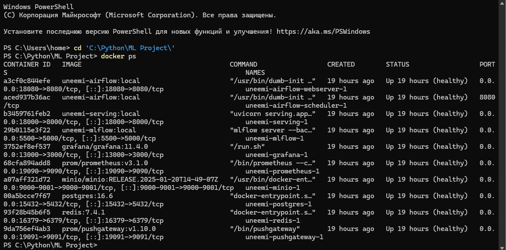
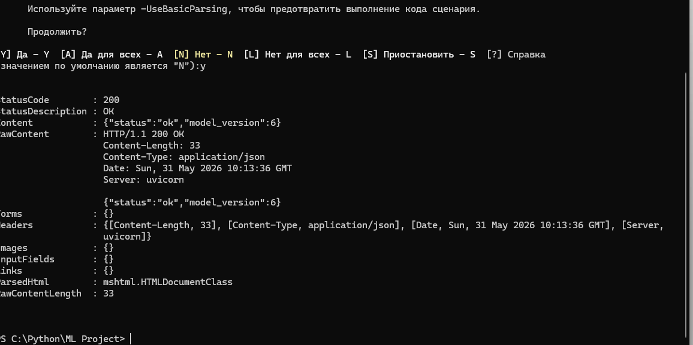
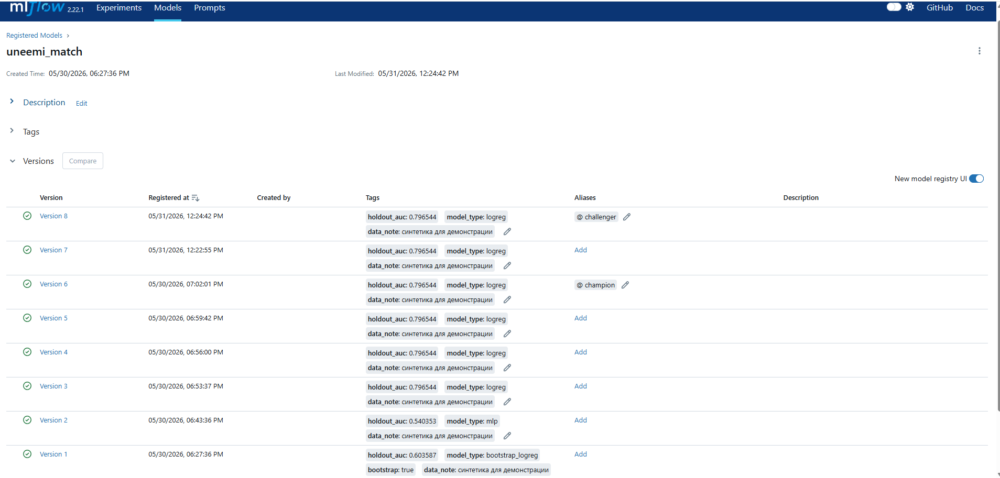
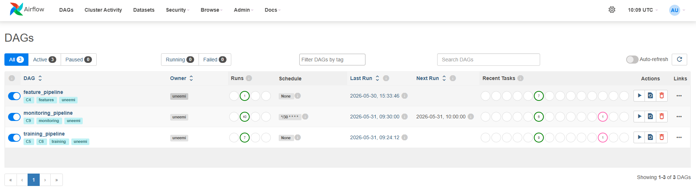
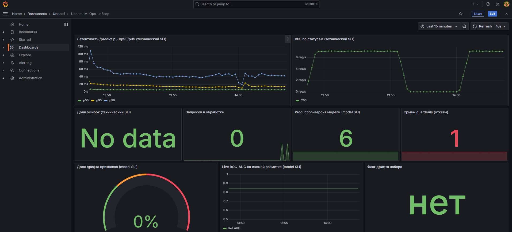

# Uneemi MLOps


ML-система вайб-матчинга (RU/CIS) уровня зрелости MLOps 2. Подбирает собеседника
по визуальной доске и короткой анкете и обслуживает полный жизненный цикл модели:
от очистки данных и обучения до вывода устаревшей модели из эксплуатации через
переключение трафика на новую.

Обучаемая модель - классификатор матча: вход 775d признаков пары профилей
(768 board-эмбеддинг SigLIP 2 + 7 quiz), выход - вероятность того, что пара перейдёт
в диалог. SigLIP 2 (ONNX) работает как слой извлечения признаков (фичестор).

## Что демонстрирует система

- Полный автоматизированный жизненный цикл: данные -> обучение -> гейт качества ->
  промоут -> сервинг -> мониторинг -> переобучение.
- Вывод модели из эксплуатации через переключение трафика: при промоуте новая версия
  переводится в Production, прежняя автоматически уходит в Archived, а сервинг горячо
  подхватывает новую версию без рестарта.
- Champion/challenger c гейтом качества: претендент попадает в Production только если
  его holdout ROC-AUC проходит порог И строго выше текущего champion.
- Continuous training: мониторинг детектит дрифт (Evidently, PSI) или падение live-AUC
  и сам триггерит переобучение.
- Guardrail rollback: при срыве p99-latency или доли ошибок сервинг откатывается на
  последнюю Archived-версию.
- 12-factor и воспроизводимость: вся конфигурация в `.env`, версии запинены, стек
  поднимается одной командой и переносим в облако.

## Архитектура



### Компоненты на перечень C1-C9 (Kreuzberger et al.)

| Компонент | Назначение | Реализация |
|---|---|---|
| C1 CI/CD | Сборка, тесты, доставка | GitHub Actions (`.github/workflows/ci.yml`): ruff + pytest + docker build |
| C2 Source repo | Версионирование кода | Этот git-репозиторий |
| C3 Оркестратор | DAG-и ML-пайплайнов | Apache Airflow (LocalExecutor + Postgres), 3 DAG в `dags/` |
| C4 Фича-стор | Offline + online фичи | Feast: offline parquet (MinIO/том), online Redis (`feature_repo/`) |
| C5 Тренировочная инфра | Вычисления обучения | Воркеры Airflow (LocalExecutor) |
| C6 Model Registry | Модели + стадии | MLflow Registry: стадии None/Staging/Production/Archived + алиасы champion/challenger |
| C7 ML metadata | Параметры, метрики, артефакты | MLflow Tracking: backend Postgres, артефакты MinIO |
| C8 Сервинг | Инференс через API | FastAPI: /health, /predict, /metrics + горячий поллер Production (`serving/`) |
| C9 Мониторинг | Качество и дрифт | Prometheus + Grafana + Evidently (`monitoring/`) |

## Технологии

Python 3.11, FastAPI, scikit-learn, ONNX Runtime, Feast 0.40 (Redis online), MLflow 2.22
(Registry + Tracking), Apache Airflow 2.10, Evidently 0.4, Prometheus + Grafana,
PostgreSQL 16, MinIO (S3), Docker Compose, Terraform (Yandex Cloud).

Пин MLflow 2.22.1 принципиален: в MLflow 3.x удалены стадии Production/Archived,
а вывод модели из эксплуатации построен именно на переходе Production -> Archived.

## Быстрый старт

```powershell
cd infra
copy .env.example .env   # 12-factor конфиг (dev-дефолты; для прода перегенерировать секреты)
.\make.ps1 up            # Windows без make. Linux/CI: make -C infra up
```

`up` идемпотентно: экспортирует ONNX (если ещё нет), скачивает банк демо-картинок
(если ещё нет), собирает образы и поднимает стек.

Оценка времени: первый запуск ~10-20 минут (сборка образов + экспорт ONNX ~370 МБ
через torch + загрузка картинок). Повторный `up` - 1-2 минуты (всё закешировано).

```powershell
.\make.ps1 ps      # ждём, пока все сервисы = Up (healthy)
.\make.ps1 smoke   # дымовой тест эндпоинтов
```

## URL и доступы (после up)

| Сервис | URL | Доступ |
|---|---|---|
| Serving /health | http://localhost:18000/health | - |
| Serving API (/predict, /metrics) | http://localhost:18000/docs | - |
| Airflow | http://localhost:18080 | admin / admin |
| MLflow | http://localhost:5500 | - |
| Grafana | http://localhost:13000 | admin / admin |
| Prometheus | http://localhost:19090 | - |
| MinIO консоль | http://localhost:9001 | minioadmin / minioadmin_dev |

Доступы выше - dev-дефолты из `.env.example` для локального запуска; для облака
секреты перегенерировать (см. `infra/terraform/README.md`).

## Демонстрируемые сценарии

DAG-и можно запускать из Airflow UI (Trigger DAG, при необходимости с config-JSON)
или из CLI. Команды с `--conf` показаны для bash / WSL / Git Bash; в PowerShell
кавычки внутри JSON искажаются - используйте Airflow UI либо bash.

```bash
DC="docker compose -f docker-compose.yml --env-file .env"

# 1) Подготовка фич: реальный SigLIP -> Feast (offline + online Redis)
$DC exec airflow-scheduler airflow dags trigger feature_pipeline

# 2) Обучение + промоут лучшей модели -> serving переключится без рестарта
$DC exec airflow-scheduler airflow dags trigger training_pipeline

# 3) Дрифт -> continuous training (сдвинутый батч детектится Evidently, триггерит обучение)
$DC exec airflow-scheduler airflow dags trigger monitoring_pipeline --conf '{"drift_scenario": true}'

# 4) Защита от деградации: гейт не пройден -> Production не меняется
$DC exec airflow-scheduler airflow dags trigger training_pipeline --conf '{"auc_threshold": 0.999}'
```

Откат по guardrails (демо-хук включён флагом `ENABLE_DEMO_HOOKS=true`):

```bash
curl -X POST "http://localhost:18000/admin/inject_latency?ms=700&count=400"
# затем поток запросов к /predict -> скользящий p99 пробивает 500 мс -> откат на Archived
```

Сквозной прогон одной командой: `make -C infra e2e` (или `.\make.ps1 e2e`).
Результаты последней проверки end-to-end: [`docs/verification_run.md`](docs/verification_run.md).

## Артефакты по критериям оценки

- Постановка цели и метрики: [`docs/goal_and_metrics.md`](docs/goal_and_metrics.md)
- Манифест (12 разделов, уровень 2): [`docs/manifest.md`](docs/manifest.md)
- Архитектура + диаграмма + маппинг C1-C9: [`docs/architecture.md`](docs/architecture.md)
- SLI/SLO на 3 уровнях: [`docs/sli_slo.md`](docs/sli_slo.md)
- MDD-анализ и ADR: [`docs/mdd/`](docs/mdd/)
- План оценки качества: [`docs/metrics_and_benchmarks.md`](docs/metrics_and_benchmarks.md)
- Отчёт о приёмочном прогоне: [`docs/verification_run.md`](docs/verification_run.md)

## Скриншоты

Скриншоты лежат в [`docs/screenshots/`](docs/screenshots/). Что показано (критерий 3):

- `docker compose ps` - все сервисы STATUS Up (healthy).
- `GET /health` -> 200 с `model_version`.
- MLflow Model Registry: версия в Production, прежняя в Archived, алиас champion.
- Airflow: успешные прогоны трёх DAG.
- Grafana: дашборд на три уровня SLI (latency, drift, AUC, версия модели).

<!-- После добавления файлов раскомментировать:





-->

## Smoke / e2e / teardown

```powershell
.\make.ps1 smoke      # health всех сервисов
.\make.ps1 e2e        # сквозной прогон пайплайнов + проверки
.\make.ps1 down       # остановить (данные сохранены)
.\make.ps1 teardown   # снести вместе с томами (docker compose down -v)
```

## Тесты

```powershell
uv sync
uv run ruff check .
uv run pytest -q   # тесты SigLIP skip без ONNX; контракт признаков и тренировка - зелёные
```

CI повторяет это на каждый push/PR (см. `.github/workflows/ci.yml`).

## Ядро SigLIP 2 (фичестор)

ONNX-инференс энкодера `google/siglip2-base-patch16-224`. Экспорт:
`uv run python scripts/export_onnx.py` (vision_model -> `models/siglip2_vision.onnx`,
delta-сверка PyTorch <-> ONNX). Sanity-результаты (не выдуманы): ImageNet zero-shot
top-1 78.48%, XM3600 RU avg R@1 73.82% (`docs/sanity_results.md`).

```python
from PIL import Image
from uneemi_ml import Siglip2Encoder
vec = Siglip2Encoder().encode(Image.open("path.jpg"))  # (1, 768), L2-norm
```

## Облачный деплой

Terraform под Yandex Cloud в [`infra/terraform/`](infra/terraform/): VPC, security
group (доступ только с заданного CIDR), VM + cloud-init (Docker + `docker compose up`),
outputs с внешними URL. Сразу после подъёма `GET /health` отвечает 200 (начальную
Production-модель регистрирует контейнер model-bootstrap), что покрывает требование
критерия 3 о живом сервисе. Порядок применения и заметки по безопасности -
в [`infra/terraform/README.md`](infra/terraform/README.md).

## Лицензия

MIT, см. [`LICENSE`](LICENSE).
