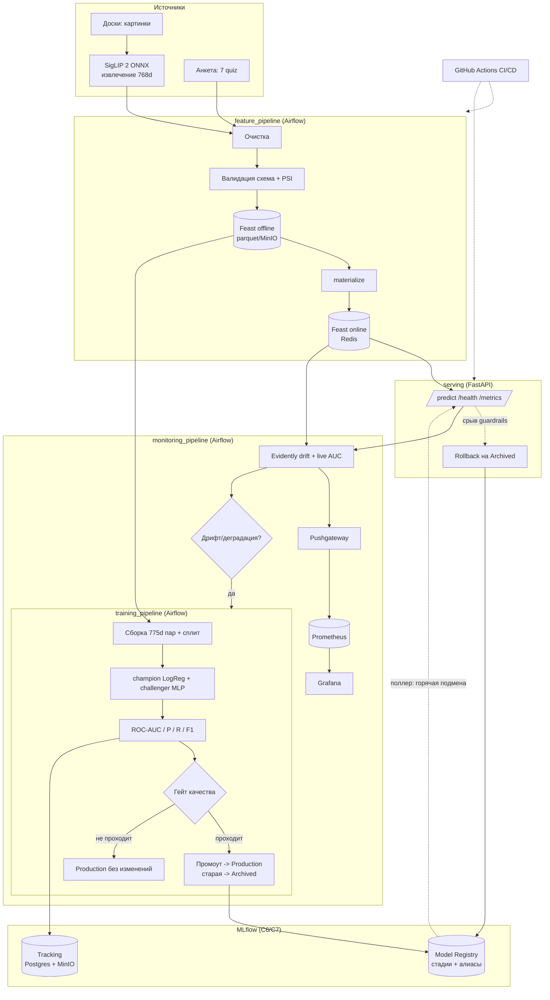

# Архитектура ML-системы Uneemi (критерий 2)

Уровень зрелости 2. Ниже - полный жизненный цикл модели (от очистки данных до
вывода устаревшей модели из эксплуатации через переключение трафика), Mermaid-
диаграмма и таблица маппинга компонентов на перечень C1-C9.

## Полный жизненный цикл

1. **Данные и фичи (feature_pipeline).** Извлечение board-эмбеддингов РЕАЛЬНЫМ
   SigLIP 2 (ONNX) по доскам + синтез quiz -> очистка -> валидация (схема: ширина
   775, типы, диапазоны; value-skew по PSI против эталона) -> запись в Feast offline
   (parquet) -> `feast apply` -> материализация в online-store (Redis). Плохие данные
   не доходят до фичестора (гейт валидации).
2. **Обучение и отбор (training_pipeline).** Историческая выборка из Feast ->
   валидация -> сборка 775d признаков пар + стратифицированный сплит -> обучение
   champion (LogReg) и challenger (MLP) -> оценка (ROC-AUC, Precision/Recall/F1 на
   holdout, всё в MLflow) -> гейт качества (AUC >= порога И выше текущего Production)
   -> регистрация версии в MLflow (алиас challenger) -> промоут: при победе версия
   переводится в Production, прежний champion уходит в Archived (**вывод из
   эксплуатации**); при провале гейта Production не меняется (защита от деградации).
3. **Сервинг с переключением трафика (serving).** FastAPI отдаёт /predict. Фоновый
   поллер раз в N секунд сверяет текущую Production-версию в MLflow и при смене
   ГОРЯЧО подменяет модель без рестарта (переключение трафика на новую модель).
   При срыве guardrails (p99 latency/доля ошибок) - откат на Archived (rollback).
4. **Мониторинг и непрерывное переобучение (monitoring_pipeline).** Сбор текущих
   признаков/предсказаний -> Evidently drift (PSI/KS) + live ROC-AUC на свежей
   разметке -> экспорт метрик в Prometheus (через Pushgateway) -> при дрифте выше
   порога ИЛИ падении метрики ниже SLO триггерится training_pipeline (continuous
   training). Петля замыкается.

## Диаграмма (Mermaid)

## Маппинг компонентов на перечень C1-C9

| Компонент | Назначение | Реализация в проекте |
|---|---|---|
| C1 CI/CD | Сборка, тесты, доставка | GitHub Actions (`.github/workflows/ci.yml`): ruff + pytest + docker build |
| C2 Source repo | Хранение и версионирование кода | Этот git-репозиторий |
| C3 Оркестратор | DAG-и ML-пайплайнов | Apache Airflow (LocalExecutor + Postgres), 3 DAG в `dags/` |
| C4 Фича-стор | Централизованные фичи offline+online | Feast: offline parquet (MinIO/том), online Redis (`feature_repo/`) |
| C5 Тренировочная инфра | Вычисления для обучения | Воркеры Airflow (scheduler, LocalExecutor) |
| C6 Model Registry | Хранение моделей + стадии | MLflow Model Registry: стадии None/Staging/Production/Archived + алиасы champion/challenger |
| C7 ML metadata | Параметры, метрики, артефакты | MLflow Tracking: backend Postgres, артефакты MinIO |
| C8 Сервинг | Инференс через API | FastAPI: /health, /predict, /metrics + горячий поллер Production (`serving/`) |
| C9 Мониторинг | Качество и дрифт | Prometheus + Grafana + Evidently (`monitoring/`) |

## Демонстрируемые сценарии
- Промоут + переключение: training_pipeline обучает лучшую модель -> Production ->
  serving горячо подхватывает новую версию без рестарта.
- Дрифт + CT: monitoring_pipeline с `conf {"drift_scenario": true}` детектит дрифт
  на сдвинутом батче и триггерит training_pipeline.
- Защита от деградации: training_pipeline с `conf {"auc_threshold": 0.999}` - версия
  регистрируется, но не проходит гейт, Production остаётся прежним.
- Rollback: при срыве guardrails сервинг откатывается на Archived-версию.
